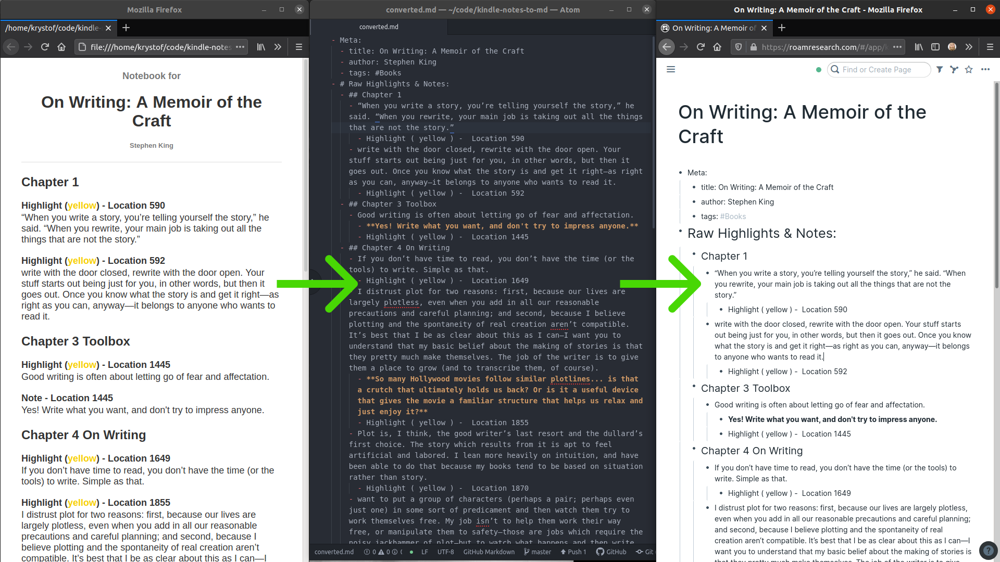

# Kindle Notes to MD

Convert an HTML file of book notes exported from an Amazon Kindle to a Markdown document.

The output format is particularly suitable for copy-pasting into
[Roam Research](https://roamresearch.com):

# Quickstart

Install python packages:

    pip install -r requirements.txt

Convert the example notes:

    kindle_notes_to_md.py example_notebook.html

Optional arguments:

    -nl, --no-location    Whether to skip export of location of notes/highlights
    -c, --clipboard       Use to export .md directly to the clipboard instead of file 
    -y, --override        Whether to override .md file in case if one already exists
    -o OUTPUT, --output   A file to which save the Markdown document

You can then open `converted.md` in your favorite text editor.

If you copy-paste the contents of that file into
[Roam Research](https://roamresearch.com), you'll get a nicely organized note as shown in the screenshot above.

# How to get your notes in HTML format

I generally read and take notes on my Kindle e-ink reader. When I finish a book, I open the same book on the Kindle app on my phone, go to "My Notebook" for the book (the icon looks like a page with lines), then Export Notebook. This saves the HTML file you can convert.
